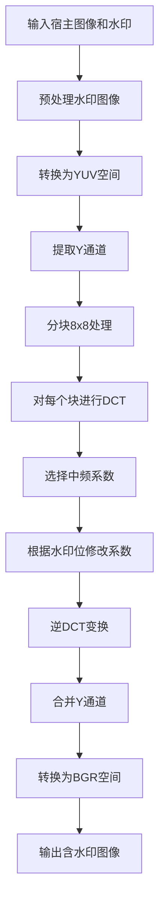
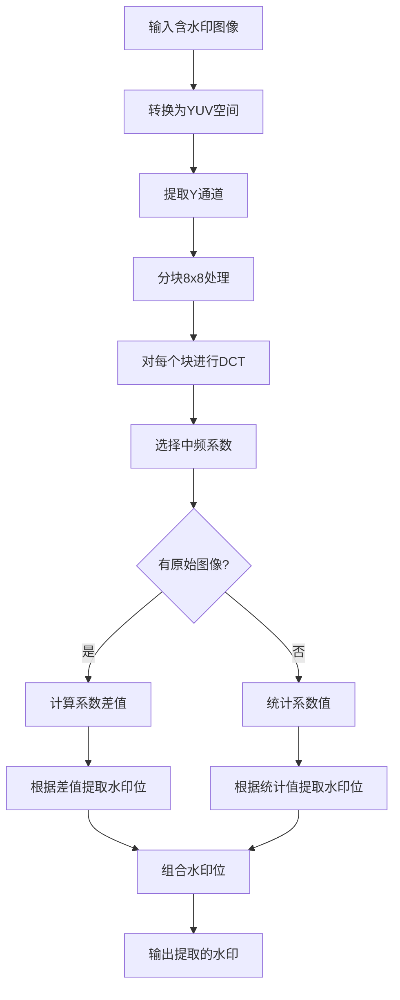

# 基于数字水印的图片泄露检测

## 1. 算法概述

本系统采用基于离散余弦变换（DCT）的数字水印技术，在图像的频域中嵌入水印信息。该技术具有以下特点：
- **不可见性**：水印嵌入后不影响图像的视觉质量
- **鲁棒性**：对常见图像处理操作具有抵抗力
- **安全性**：水印嵌入位置和强度可调整，提高安全性

## 2. 数学原理

### 2.1 离散余弦变换（DCT）

DCT将图像从空间域转换到频率域，其二维DCT公式为：

$$
F(u,v) = \frac{2}{N} C(u)C(v) \sum_{x=0}^{N-1} \sum_{y=0}^{N-1} f(x,y) \cos\left(\frac{(2x+1)u\pi}{2N}\right) \cos\left(\frac{(2y+1)v\pi}{2N}\right)
$$

其中：
- $f(x,y)$ 是空间域的像素值
- $F(u,v)$ 是频率域的系数
- $N$ 是块大小（通常为8）
- $C(u), C(v) = \begin{cases} 
      \frac{1}{\sqrt{2}} & \text{for } u,v = 0 \\
      1 & \text{otherwise}
   \end{cases}$

### 2.2 水印嵌入模型

水印嵌入在DCT系数的中频区域，嵌入公式为：

$$
F'(u,v) = F(u,v) + \alpha \cdot |F(u,v)| \cdot W
$$

其中：
- $F'(u,v)$ 是修改后的DCT系数
- $F(u,v)$ 是原始DCT系数
- $\alpha$ 是水印强度因子（0.05-0.1）
- $W$ 是水印位（0或1）

### 2.3 水印提取模型

当有原始图像时，水印提取公式为：

$$
W' = \begin{cases} 
      1 & \text{if } F_w(u,v) - F_o(u,v) > 0 \\
      0 & \text{otherwise}
   \end{cases}
$$

其中：
- $F_w(u,v)$ 是含水印图像的DCT系数
- $F_o(u,v)$ 是原始图像的DCT系数

当没有原始图像时，使用统计方法：

$$
W' = \begin{cases} 
      1 & \text{if } F_w(u,v) > \mu \\
      0 & \text{otherwise}
   \end{cases}
$$

其中 $\mu$ 是系数的统计平均值

## 3. 算法流程

### 3.1 水印嵌入流程

### 3.2 水印提取流程

## 4. 关键参数

1. **水印强度因子（α）**：
   - 范围：0.05-0.1
   - 影响：值越大，鲁棒性越强，但不可见性降低

2. **嵌入位置**：
   - 中频区域：(1,1)到(4,4)且i+j>2的系数
   - 避开低频（能量集中区）和高频（易被压缩去除）

3. **块大小**：
   - 固定为8×8像素
   - 与JPEG压缩标准兼容

## 5. 鲁棒性分析

### 5.1 攻击类型与数学模型

| 攻击类型 | 数学表示 | 对水印的影响 |
|---------|---------|------------|
| **旋转攻击** | $I'(x,y) = I(x\cos\theta - y\sin\theta, x\sin\theta + y\cos\theta)$ | 破坏块结构，导致系数错位 |
| **裁剪攻击** | $I'(x,y) = I(x + \Delta x, y + \Delta y)$ | 丢失部分水印信息 |
| **对比度调整** | $I'(x,y) = k \cdot I(x,y) + b$ | 改变系数比例关系 |
| **亮度调整** | $I'(x,y) = I(x,y) + \Delta L$ | 主要影响DC系数 |
| **高斯噪声** | $I'(x,y) = I(x,y) + N(0,\sigma^2)$ | 增加高频噪声 |
| **JPEG压缩** | 量化：$Q(u,v) = \text{round}\left(\frac{F(u,v)}{Q_{\text{table}}(u,v)}\right)$ | 量化误差引入失真 |
| **模糊攻击** | $I'(x,y) = I(x,y) * G(\sigma)$ | 平滑高频信息 |
| **缩放攻击** | $I'(x,y) = \text{resize}(I, s)$ | 重采样引入插值误差 |

### 5.2 评估指标

1. **结构相似性（SSIM）**：
   $$
   \text{SSIM}(x,y) = \frac{(2\mu_x\mu_y + c_1)(2\sigma_{xy} + c_2)}{(\mu_x^2 + \mu_y^2 + c_1)(\sigma_x^2 + \sigma_y^2 + c_2)}
   $$
   - 范围：[0,1]，值越大表示越相似
   - 衡量提取水印与原始水印的结构相似性

2. **误码率（BER）**：
   $$
   \text{BER} = \frac{\text{错误比特数}}{\text{总比特数}}
   $$
   - 范围：[0,1]，值越小表示准确性越高
   - 直接衡量水印提取的准确性

## 6. 性能优化策略

1. **自适应水印强度**：
   - 根据图像局部特征调整α值
   - 公式：$\alpha(x,y) = k \cdot \sigma_{\text{local}}(x,y)$
   - 其中$\sigma_{\text{local}}$是局部方差

2. **纠错编码**：
   - 对水印信息使用汉明码或RS码
   - 提高对噪声和压缩的抵抗力

3. **多位置嵌入**：
   - 在多个频带嵌入相同水印
   - 提高对特定攻击的鲁棒性

4. **特征点同步**：
   - 结合SIFT/SURF特征点
   - 抵抗几何攻击（旋转、缩放）
